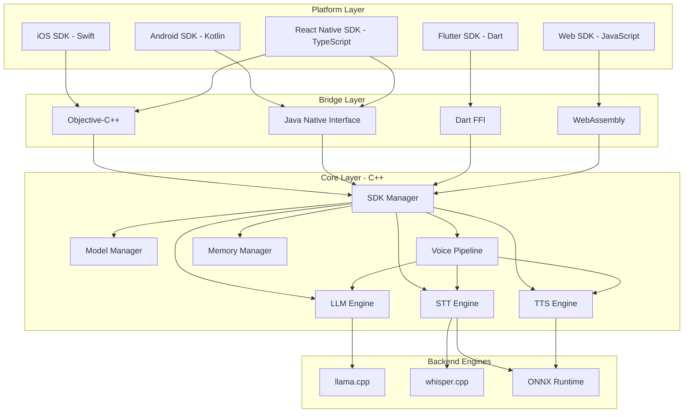

# Design Document: On-Device AI SDK

## Overview

The On-Device AI SDK is a comprehensive multi-platform solution that enables developers to integrate on-device AI capabilities into their applications. The SDK provides three core AI capabilities: Large Language Model (LLM) inference, Speech-to-Text (STT) transcription, and Text-to-Speech (TTS) synthesis, along with a Voice Pipeline that orchestrates these components for conversational experiences.

The architecture follows a three-tier design:
1. **Platform Layer**: Native SDKs in Swift (iOS), Kotlin (Android), TypeScript (React Native), Dart (Flutter), and JavaScript (Web)
2. **Bridge Layer**: Platform-specific translation mechanisms (FFI, JNI, Objective-C++, WASM)
3. **Core Layer**: Shared C++ implementation containing all business logic and inference engines

This design ensures code reuse, consistent behavior across platforms, and optimal performance through native execution. All processing occurs on-device, ensuring complete privacy and offline functionality.

### Design Goals

- **Cross-platform consistency**: Same API patterns and behavior across all platforms
- **Performance**: 5-20 tokens/second on mid-range devices for 3B parameter models
- **Memory efficiency**: Under 3GB RAM for 3B parameter models
- **Small binary size**: Under 50MB per platform
- **Developer experience**: Working demo in under 10 minutes
- **Privacy-first**: All processing on-device, no data transmission

## Architecture

### High-Level Architecture



### Component Architecture

The SDK is organized into distinct components with clear responsibilities:

**SDK Manager**: Central coordinator for initialization, configuration, and lifecycle management. Manages global state including thread pools, logging configuration, and resource limits.

**Model Manager**: Handles all model-related operations including discovery from remote registry, downloading with progress tracking and resumption, integrity verification using SHA-256 checksums, local storage management, and version tracking.

**LLM Engine**: Wraps llama.cpp for language model inference. Manages model loading using memory mapping, tokenization/detokenization, inference execution with configurable sampling, streaming generation, and KV cache management for efficient sequential generation.

**STT Engine**: Wraps whisper.cpp for speech recognition. Handles audio preprocessing (resampling, normalization), Voice Activity Detection, transcription with confidence scores, and multi-language support.

**TTS Engine**: Wraps ONNX Runtime for speech synthesis. Processes text into phonemes and prosody, generates audio waveforms, supports multiple voices and languages, and outputs in standard formats (PCM, WAV).

**Voice Pipeline**: Orchestrates end-to-end voice conversations. Chains STT → LLM → TTS, manages conversation context and history, handles interruptions and cancellations, and provides unified interface for voice interactions.

**Memory Manager**: Monitors memory usage across all components, implements model swapping strategies, uses memory mapping for efficient loading, handles out-of-memory conditions gracefully, and provides memory pressure callbacks.

### Threading Model

The SDK uses a multi-threaded architecture to ensure responsiveness:

- **Main Thread**: SDK initialization, configuration, model loading/unloading, synchronous API calls
- **Inference Thread Pool**: Parallel execution of LLM, STT, and TTS operations (configurable size)
- **I/O Thread**: Model file reading, audio file I/O, network operations for downloads
- **Callback Thread**: Streaming token callbacks, progress updates, event notifications

Thread safety is ensured through:
- Mutex protection for shared resources
- Lock-free queues for callback delivery
- Thread-local storage for inference contexts
- Atomic operations for reference counting

### Data Flow

**Inference Request Flow**:
1. Application calls platform SDK method (e.g., `generateText()`)
2. Platform SDK validates input and marshals data
3. Bridge layer converts to C++ types
4. Core SDK routes to appropriate engine
5. Engine loads model if needed (using memory mapping)
6. Backend executes inference
7. Results flow back through bridge
8. Platform SDK returns to application

**Streaming Response Flow**:
1. Application initiates streaming with callback
2. Platform SDK establishes callback bridge
3. Core SDK starts streaming inference
4. Each token triggers callback through bridge
5. Platform SDK invokes application callback on appropriate thread
6. Continues until completion or cancellation

**Model Download Flow**:
1. Application requests model download
2. Model Manager queries registry for metadata
3. Checks storage space availability
4. Downloads to temporary location with progress callbacks
5. Verifies integrity with SHA-256 checksum
6. Atomically moves to final location
7. Updates local registry
8. Notifies application of completion

## Components and Interfaces

### Core C++ Components

#### SDK Manager

```cpp
class SDKManager {
public:
    // Initialization and configuration
    static Result<SDKManager*> initialize(const SDKConfig& config);
    static void shutdown();
    
    // Configuration
    void setThreadCount(int count);
    void setModelDirectory(const std::string& path);
    void setLogLevel(LogLevel level);
    void setMemoryLimit(size_t bytes);
    
    // Component access
    ModelManager* getModelManager();
    LLMEngine* getLLMEngine();
    STTEngine* getSTTEngine();
    TTSEngine* getTTSEngine();
    VoicePipeline* getVoicePipeline();
    
private:
    SDKConfig config_;
    std::unique_ptr<ModelManager> model_manager_;
    std::unique_ptr<LLMEngine> llm_engine_;
    std::unique_ptr<STTEngine> stt_engine_;
    std::unique_ptr<TTSEngine> tts_engine_;
    std::unique_ptr<VoicePipeline> voice_pipeline_;
    std::unique_ptr<MemoryManager> memory_manager_;
    ThreadPool inference_pool_;
    ThreadPool io_pool_;
};

struct SDKConfig {
    int thread_count = 4;
    std::string model_directory;
    LogLevel log_level = LogLevel::Info;
    size_t memory_limit = 0; // 0 = no limit
    bool enable_telemetry = false;
};
```

#### Model Manager

```cpp
class ModelManager {
public:
    // Model discovery
    Result<std::vector<ModelInfo>> listAvailableModels(
        ModelType type = ModelType::All,
        const DeviceCapabilities& device = DeviceCapabilities::current()
    );
    
    Result<std::vector<ModelInfo>> listDownloadedModels();
    
    // Model download
    Result<DownloadHandle> downloadModel(
        const std::string& model_id,
        ProgressCallback progress_callback
    );
    
    Result<void> cancelDownload(DownloadHandle handle);
    Result<void> deleteModel(const std::string& model_id);
    
    // Model information
    Result<ModelInfo> getModelInfo(const std::string& model_id);
    Result<bool> isModelDownloaded(const std::string& model_id);
    Result<std::string> getModelPath(const std::string& model_id);
    
    // Version management
    Result<std::vector<std::string>> getAvailableVersions(const std::string& model_id);
    Result<ModelInfo> checkForUpdates(const std::string& model_id);
    
    // Storage management
    Result<StorageInfo> getStorageInfo();
    
private:
    std::string registry_url_;
    std::string local_storage_path_;
    std::map<std::string, ModelInfo> local_registry_;
    std::map<DownloadHandle, std::unique_ptr<Download>> active_downloads_;
};

struct ModelInfo {
    std::string id;
    std::string name;
    ModelType type;
    std::string version;
    size_t size_bytes;
    std::string download_url;
    std::string checksum_sha256;
    std::map<std::string, std::string> metadata;
    DeviceRequirements requirements;
};

struct DeviceCapabilities {
    size_t ram_bytes;
    size_t storage_bytes;
    std::string platform;
    std::vector<std::string> accelerators;
    
    static DeviceCapabilities current();
};

struct StorageInfo {
    size_t total_bytes;
    size_t available_bytes;
    size_t used_by_models_bytes;
};
```

#### LLM Engine

```cpp
class LLMEngine {
public:
    // Model management
    Result<ModelHandle> loadModel(const std::string& model_path);
    Result<void> unloadModel(ModelHandle handle);
    
    // Synchronous inference
    Result<std::string> generate(
        ModelHandle handle,
        const std::string& prompt,
        const GenerationConfig& config = GenerationConfig::defaults()
    );
    
    // Streaming inference
    Result<void> generateStreaming(
        ModelHandle handle,
        const std::string& prompt,
        TokenCallback callback,
        const GenerationConfig& config = GenerationConfig::defaults()
    );
    
    // Context management
    Result<void> clearContext(ModelHandle handle);
    Result<std::vector<std::string>> getConversationHistory(ModelHandle handle);
    
    // Tokenization
    Result<std::vector<int>> tokenize(ModelHandle handle, const std::string& text);
    Result<std::string> detokenize(ModelHandle handle, const std::vector<int>& tokens);
    
private:
    std::map<ModelHandle, std::unique_ptr<LLMModel>> loaded_models_;
    llama_context* llama_ctx_;
};

struct GenerationConfig {
    int max_tokens = 512;
    float temperature = 0.7f;
    float top_p = 0.9f;
    int top_k = 40;
    float repetition_penalty = 1.1f;
    std::vector<std::string> stop_sequences;
    
    static GenerationConfig defaults();
};

using TokenCallback = std::function<void(const std::string& token)>;
```

#### STT Engine

```cpp
class STTEngine {
public:
    // Model management
    Result<ModelHandle> loadModel(const std::string& model_path);
    Result<void> unloadModel(ModelHandle handle);
    
    // Transcription
    Result<Transcription> transcribe(
        ModelHandle handle,
        const AudioData& audio,
        const TranscriptionConfig& config = TranscriptionConfig::defaults()
    );
    
    // Streaming transcription
    Result<void> transcribeStreaming(
        ModelHandle handle,
        AudioStreamCallback audio_callback,
        TranscriptionCallback result_callback,
        const TranscriptionConfig& config = TranscriptionConfig::defaults()
    );
    
    // Voice Activity Detection
    Result<std::vector<AudioSegment>> detectVoiceActivity(const AudioData& audio);
    
private:
    std::map<ModelHandle, std::unique_ptr<STTModel>> loaded_models_;
    whisper_context* whisper_ctx_;
};

struct AudioData {
    std::vector<float> samples; // PCM float32, mono
    int sample_rate;
    
    static Result<AudioData> fromFile(const std::string& path);
    static Result<AudioData> fromWAV(const std::vector<uint8_t>& wav_data);
};

struct Transcription {
    std::string text;
    float confidence;
    std::string language;
    std::vector<Word> words; // Word-level timestamps
};

struct Word {
    std::string text;
    float start_time;
    float end_time;
    float confidence;
};

struct TranscriptionConfig {
    std::string language = "auto"; // auto-detect or specific language code
    bool translate_to_english = false;
    bool word_timestamps = false;
    
    static TranscriptionConfig defaults();
};
```

#### TTS Engine

```cpp
class TTSEngine {
public:
    // Model management
    Result<ModelHandle> loadModel(const std::string& model_path);
    Result<void> unloadModel(ModelHandle handle);
    
    // Synthesis
    Result<AudioData> synthesize(
        ModelHandle handle,
        const std::string& text,
        const SynthesisConfig& config = SynthesisConfig::defaults()
    );
    
    // Streaming synthesis
    Result<void> synthesizeStreaming(
        ModelHandle handle,
        const std::string& text,
        AudioChunkCallback callback,
        const SynthesisConfig& config = SynthesisConfig::defaults()
    );
    
    // Voice information
    Result<std::vector<VoiceInfo>> getAvailableVoices(ModelHandle handle);
    
private:
    std::map<ModelHandle, std::unique_ptr<TTSModel>> loaded_models_;
    Ort::Env onnx_env_;
    std::map<ModelHandle, std::unique_ptr<Ort::Session>> onnx_sessions_;
};

struct SynthesisConfig {
    std::string voice_id;
    float speed = 1.0f;
    float pitch = 1.0f;
    
    static SynthesisConfig defaults();
};

struct VoiceInfo {
    std::string id;
    std::string name;
    std::string language;
    std::string gender;
};

using AudioChunkCallback = std::function<void(const AudioData& chunk)>;
```

#### Voice Pipeline

```cpp
class VoicePipeline {
public:
    // Configuration
    Result<void> configure(
        ModelHandle stt_model,
        ModelHandle llm_model,
        ModelHandle tts_model,
        const PipelineConfig& config = PipelineConfig::defaults()
    );
    
    // Conversation
    Result<void> startConversation(
        AudioStreamCallback audio_input,
        AudioChunkCallback audio_output,
        TranscriptionCallback transcription_callback,
        TextCallback llm_response_callback
    );
    
    Result<void> stopConversation();
    Result<void> interrupt(); // Stop current TTS playback
    
    // Context management
    Result<void> clearHistory();
    Result<std::vector<ConversationTurn>> getHistory();
    
private:
    STTEngine* stt_engine_;
    LLMEngine* llm_engine_;
    TTSEngine* tts_engine_;
    
    ModelHandle stt_model_;
    ModelHandle llm_model_;
    ModelHandle tts_model_;
    
    std::vector<ConversationTurn> history_;
    std::atomic<bool> is_active_;
};

struct PipelineConfig {
    GenerationConfig llm_config;
    TranscriptionConfig stt_config;
    SynthesisConfig tts_config;
    bool enable_vad = true;
    float vad_threshold = 0.5f;
    
    static PipelineConfig defaults();
};

struct ConversationTurn {
    std::string user_text;
    std::string assistant_text;
    float timestamp;
};

using TranscriptionCallback = std::function<void(const std::string& text)>;
using TextCallback = std::function<void(const std::string& text)>;
```

### Platform-Specific Interfaces

#### iOS SDK (Swift)

```swift
public class OnDeviceAI {
    // Initialization
    public static func initialize(config: SDKConfig = .default) throws -> OnDeviceAI
    public func shutdown()
    
    // Component access
    public var modelManager: ModelManager { get }
    public var llm: LLMEngine { get }
    public var stt: STTEngine { get }
    public var tts: TTSEngine { get }
    public var voicePipeline: VoicePipeline { get }
}

public class ModelManager {
    // Model discovery
    public func listAvailableModels(
        type: ModelType = .all,
        device: DeviceCapabilities = .current
    ) async throws -> [ModelInfo]
    
    public func listDownloadedModels() throws -> [ModelInfo]
    
    // Model download
    public func downloadModel(
        _ modelId: String,
        progress: @escaping (Double) -> Void
    ) async throws
    
    public func deleteModel(_ modelId: String) throws
    
    // Model information
    public func isModelDownloaded(_ modelId: String) -> Bool
    public func getStorageInfo() throws -> StorageInfo
}

public class LLMEngine {
    // Model management
    public func loadModel(path: String) async throws -> ModelHandle
    public func unloadModel(_ handle: ModelHandle) throws
    
    // Synchronous inference
    public func generate(
        model: ModelHandle,
        prompt: String,
        config: GenerationConfig = .default
    ) async throws -> String
    
    // Streaming inference
    public func generateStreaming(
        model: ModelHandle,
        prompt: String,
        config: GenerationConfig = .default,
        onToken: @escaping (String) -> Void
    ) async throws
    
    // Context management
    public func clearContext(model: ModelHandle) throws
    public func getConversationHistory(model: ModelHandle) throws -> [String]
}

public class STTEngine {
    // Model management
    public func loadModel(path: String) async throws -> ModelHandle
    public func unloadModel(_ handle: ModelHandle) throws
    
    // Transcription
    public func transcribe(
        model: ModelHandle,
        audio: AudioData,
        config: TranscriptionConfig = .default
    ) async throws -> Transcription
    
    // Voice Activity Detection
    public func detectVoiceActivity(audio: AudioData) throws -> [AudioSegment]
}

public class TTSEngine {
    // Model management
    public func loadModel(path: String) async throws -> ModelHandle
    public func unloadModel(_ handle: ModelHandle) throws
    
    // Synthesis
    public func synthesize(
        model: ModelHandle,
        text: String,
        config: SynthesisConfig = .default
    ) async throws -> AudioData
    
    // Voice information
    public func getAvailableVoices(model: ModelHandle) throws -> [VoiceInfo]
}

public class VoicePipeline {
    // Configuration
    public func configure(
        sttModel: ModelHandle,
        llmModel: ModelHandle,
        ttsModel: ModelHandle,
        config: PipelineConfig = .default
    ) throws
    
    // Conversation
    public func startConversation(
        audioInput: @escaping () async -> AudioData?,
        audioOutput: @escaping (AudioData) -> Void,
        onTranscription: @escaping (String) -> Void,
        onResponse: @escaping (String) -> Void
    ) async throws
    
    public func stopConversation()
    public func interrupt()
    
    // Context management
    public func clearHistory()
    public func getHistory() -> [ConversationTurn]
}
```

#### Android SDK (Kotlin)

```kotlin
class OnDeviceAI private constructor() {
    companion object {
        suspend fun initialize(config: SDKConfig = SDKConfig.default()): OnDeviceAI
    }
    
    fun shutdown()
    
    val modelManager: ModelManager
    val llm: LLMEngine
    val stt: STTEngine
    val tts: TTSEngine
    val voicePipeline: VoicePipeline
}

class ModelManager internal constructor() {
    // Model discovery
    suspend fun listAvailableModels(
        type: ModelType = ModelType.ALL,
        device: DeviceCapabilities = DeviceCapabilities.current()
    ): List<ModelInfo>
    
    fun listDownloadedModels(): List<ModelInfo>
    
    // Model download
    suspend fun downloadModel(
        modelId: String,
        onProgress: (Double) -> Unit
    )
    
    fun deleteModel(modelId: String)
    
    // Model information
    fun isModelDownloaded(modelId: String): Boolean
    fun getStorageInfo(): StorageInfo
}

class LLMEngine internal constructor() {
    // Model management
    suspend fun loadModel(path: String): ModelHandle
    fun unloadModel(handle: ModelHandle)
    
    // Synchronous inference
    suspend fun generate(
        model: ModelHandle,
        prompt: String,
        config: GenerationConfig = GenerationConfig.default()
    ): String
    
    // Streaming inference
    suspend fun generateStreaming(
        model: ModelHandle,
        prompt: String,
        config: GenerationConfig = GenerationConfig.default(),
        onToken: (String) -> Unit
    )
    
    // Context management
    fun clearContext(model: ModelHandle)
    fun getConversationHistory(model: ModelHandle): List<String>
}

class STTEngine internal constructor() {
    // Model management
    suspend fun loadModel(path: String): ModelHandle
    fun unloadModel(handle: ModelHandle)
    
    // Transcription
    suspend fun transcribe(
        model: ModelHandle,
        audio: AudioData,
        config: TranscriptionConfig = TranscriptionConfig.default()
    ): Transcription
    
    // Voice Activity Detection
    fun detectVoiceActivity(audio: AudioData): List<AudioSegment>
}

class TTSEngine internal constructor() {
    // Model management
    suspend fun loadModel(path: String): ModelHandle
    fun unloadModel(handle: ModelHandle)
    
    // Synthesis
    suspend fun synthesize(
        model: ModelHandle,
        text: String,
        config: SynthesisConfig = SynthesisConfig.default()
    ): AudioData
    
    // Voice information
    fun getAvailableVoices(model: ModelHandle): List<VoiceInfo>
}

class VoicePipeline internal constructor() {
    // Configuration
    fun configure(
        sttModel: ModelHandle,
        llmModel: ModelHandle,
        ttsModel: ModelHandle,
        config: PipelineConfig = PipelineConfig.default()
    )
    
    // Conversation
    suspend fun startConversation(
        audioInput: suspend () -> AudioData?,
        audioOutput: (AudioData) -> Unit,
        onTranscription: (String) -> Unit,
        onResponse: (String) -> Unit
    )
    
    fun stopConversation()
    fun interrupt()
    
    // Context management
    fun clearHistory()
    fun getHistory(): List<ConversationTurn>
}
```

#### React Native SDK (TypeScript)

```typescript
export class OnDeviceAI {
  // Initialization
  static async initialize(config?: SDKConfig): Promise<OnDeviceAI>;
  shutdown(): void;
  
  // Component access
  readonly modelManager: ModelManager;
  readonly llm: LLMEngine;
  readonly stt: STTEngine;
  readonly tts: TTSEngine;
  readonly voicePipeline: VoicePipeline;
}

export class ModelManager {
  // Model discovery
  async listAvailableModels(
    type?: ModelType,
    device?: DeviceCapabilities
  ): Promise<ModelInfo[]>;
  
  listDownloadedModels(): ModelInfo[];
  
  // Model download
  async downloadModel(
    modelId: string,
    onProgress: (progress: number) => void
  ): Promise<void>;
  
  deleteModel(modelId: string): void;
  
  // Model information
  isModelDownloaded(modelId: string): boolean;
  getStorageInfo(): StorageInfo;
}

export class LLMEngine {
  // Model management
  async loadModel(path: string): Promise<ModelHandle>;
  unloadModel(handle: ModelHandle): void;
  
  // Synchronous inference
  async generate(
    model: ModelHandle,
    prompt: string,
    config?: GenerationConfig
  ): Promise<string>;
  
  // Streaming inference
  async generateStreaming(
    model: ModelHandle,
    prompt: string,
    onToken: (token: string) => void,
    config?: GenerationConfig
  ): Promise<void>;
  
  // Context management
  clearContext(model: ModelHandle): void;
  getConversationHistory(model: ModelHandle): string[];
}

export class STTEngine {
  // Model management
  async loadModel(path: string): Promise<ModelHandle>;
  unloadModel(handle: ModelHandle): void;
  
  // Transcription
  async transcribe(
    model: ModelHandle,
    audio: AudioData,
    config?: TranscriptionConfig
  ): Promise<Transcription>;
  
  // Voice Activity Detection
  detectVoiceActivity(audio: AudioData): AudioSegment[];
}

export class TTSEngine {
  // Model management
  async loadModel(path: string): Promise<ModelHandle>;
  unloadModel(handle: ModelHandle): void;
  
  // Synthesis
  async synthesize(
    model: ModelHandle,
    text: string,
    config?: SynthesisConfig
  ): Promise<AudioData>;
  
  // Voice information
  getAvailableVoices(model: ModelHandle): VoiceInfo[];
}

export class VoicePipeline {
  // Configuration
  configure(
    sttModel: ModelHandle,
    llmModel: ModelHandle,
    ttsModel: ModelHandle,
    config?: PipelineConfig
  ): void;
  
  // Conversation
  async startConversation(
    audioInput: () => Promise<AudioData | null>,
    audioOutput: (audio: AudioData) => void,
    onTranscription: (text: string) => void,
    onResponse: (text: string) => void
  ): Promise<void>;
  
  stopConversation(): void;
  interrupt(): void;
  
  // Context management
  clearHistory(): void;
  getHistory(): ConversationTurn[];
}
```

## Data Models

### Core Data Structures

**ModelHandle**: Opaque handle representing a loaded model instance. Used to reference models across API calls. Internally maps to C++ model pointers.

**ModelInfo**: Complete metadata about a model including:
- `id`: Unique identifier (e.g., "llama-3b-q4")
- `name`: Human-readable name
- `type`: LLM, STT, or TTS
- `version`: Semantic version string
- `size_bytes`: Total file size
- `download_url`: HTTPS URL for download
- `checksum_sha256`: SHA-256 hash for verification
- `metadata`: Additional key-value pairs (architecture, context_length, etc.)
- `requirements`: Minimum device specifications

**AudioData**: Represents audio in a platform-independent format:
- `samples`: Float32 PCM samples, mono channel, normalized to [-1.0, 1.0]
- `sample_rate`: Samples per second (typically 16000 for STT, 22050 for TTS)
- Conversion methods for platform-specific formats (AVAudioPCMBuffer on iOS, AudioTrack on Android)

**Transcription**: Result of speech-to-text operation:
- `text`: Transcribed text
- `confidence`: Overall confidence score [0.0, 1.0]
- `language`: Detected or specified language code
- `words`: Optional word-level timestamps and confidence

**GenerationConfig**: Controls LLM text generation:
- `max_tokens`: Maximum tokens to generate
- `temperature`: Randomness control [0.0, 2.0], higher = more random
- `top_p`: Nucleus sampling threshold [0.0, 1.0]
- `top_k`: Top-k sampling limit
- `repetition_penalty`: Penalty for repeated tokens [1.0, 2.0]
- `stop_sequences`: Strings that stop generation

**TranscriptionConfig**: Controls STT behavior:
- `language`: Language code or "auto" for detection
- `translate_to_english`: Whether to translate to English
- `word_timestamps`: Whether to include word-level timing

**SynthesisConfig**: Controls TTS behavior:
- `voice_id`: Identifier for voice to use
- `speed`: Speech rate multiplier [0.5, 2.0]
- `pitch`: Pitch adjustment [-1.0, 1.0]

**PipelineConfig**: Controls Voice Pipeline behavior:
- `llm_config`: GenerationConfig for LLM
- `stt_config`: TranscriptionConfig for STT
- `tts_config`: SynthesisConfig for TTS
- `enable_vad`: Whether to use Voice Activity Detection
- `vad_threshold`: Sensitivity for VAD [0.0, 1.0]

### Error Handling

All operations return `Result<T>` types (or throw exceptions in platform SDKs) with detailed error information:

**Error Categories**:
- `ModelNotFound`: Requested model doesn't exist
- `ModelLoadError`: Failed to load model (corrupted, incompatible, insufficient memory)
- `InferenceError`: Error during inference execution
- `NetworkError`: Network failure during download
- `StorageError`: Insufficient storage or I/O error
- `InvalidInput`: Invalid parameters or data
- `ResourceExhausted`: Out of memory or other resources
- `Cancelled`: Operation was cancelled by user

**Error Structure**:
```cpp
struct Error {
    ErrorCode code;
    std::string message;
    std::string details;
    std::optional<std::string> recovery_suggestion;
};
```

Each error includes:
- Specific error code for programmatic handling
- Human-readable message
- Technical details for debugging
- Optional suggestion for recovery

### Memory Management

**Memory Mapping Strategy**:
- Models loaded using `mmap()` for efficient memory usage
- Read-only mapping allows OS to page in/out as needed
- Multiple model instances can share same physical memory
- Reduces load time from seconds to milliseconds

**Reference Counting**:
- ModelHandle uses reference counting for automatic cleanup
- Models unloaded when last reference is released
- Platform SDKs integrate with native memory management (ARC on iOS, GC on Android/JVM)

**Memory Limits**:
- Configurable global memory limit
- Per-model memory tracking
- Automatic unloading of least-recently-used models when limit approached
- Memory pressure callbacks to application

**Buffer Management**:
- Pre-allocated buffer pools for inference
- Reduces allocation overhead and fragmentation
- Separate pools for different data types (tokens, audio samples, embeddings)

## Correctness Properties

*A property is a characteristic or behavior that should hold true across all valid executions of a system—essentially, a formal statement about what the system should do. Properties serve as the bridge between human-readable specifications and machine-verifiable correctness guarantees.*

Before defining the correctness properties, let me analyze each acceptance criterion for testability:


### Property Reflection

After analyzing all acceptance criteria, I've identified the following areas of redundancy:

1. **Offline operation** (11.1, 11.2, 11.3, 21.1) - Can be consolidated into one property about inference working without network
2. **Streaming consistency** (1.6, 12.1) - Same requirement stated twice
3. **Platform consistency** (7.7) - Subsumes individual platform tests
4. **Error recovery** (13.4) - Covers multiple specific error scenarios
5. **Resource cleanup** (15.1-15.6) - Can be tested with general cleanup property plus specific examples
6. **Model format support** (1.4, 19.1-19.6) - Can be consolidated into format loading tests

The properties below focus on unique validation value, avoiding redundant tests.

### Correctness Properties

Property 1: Tokenization Round Trip
*For any* valid text input, tokenizing then detokenizing should produce equivalent text (preserving semantic meaning, allowing for whitespace normalization)
**Validates: Requirements 1.2**

Property 2: Inference Produces Output
*For any* valid prompt and loaded LLM model, inference should generate a non-empty text response
**Validates: Requirements 1.3**

Property 3: Streaming and Synchronous Equivalence
*For any* prompt and generation configuration, streaming generation (collecting all tokens) should produce the same final text as synchronous generation
**Validates: Requirements 1.6, 12.1**

Property 4: Context Window Enforcement
*For any* LLM model with specified context window limit, the total tokens (prompt + generation) should not exceed the model's maximum context length
**Validates: Requirements 1.8**

Property 5: Transcription Confidence Scores
*For any* audio input transcribed by STT engine, the returned transcription should include a confidence score in the range [0.0, 1.0]
**Validates: Requirements 2.4**

Property 6: TTS Parameter Effects
*For any* text input, synthesizing with different speed or pitch parameters should produce audio with different characteristics (duration or frequency content)
**Validates: Requirements 3.3**

Property 7: Voice Pipeline Context Maintenance
*For any* sequence of conversation turns in the voice pipeline, each turn should have access to the context from all previous turns
**Validates: Requirements 4.6, 24.1**

Property 8: Model Filtering Correctness
*For any* filter criteria (type, platform, device capabilities), all returned models should satisfy the filter conditions
**Validates: Requirements 5.2**

Property 9: Download Progress Monotonicity
*For any* model download, progress callbacks should report non-decreasing values (bytes downloaded should never decrease)
**Validates: Requirements 5.4**

Property 10: Downloaded Models in Registry
*For any* successfully downloaded model, querying the local registry should return the model with correct metadata including version and timestamp
**Validates: Requirements 5.7**

Property 11: Download Retry Backoff
*For any* failed download with retry enabled, subsequent retry attempts should have exponentially increasing delays
**Validates: Requirements 5.9**

Property 12: Semantic Versioning Format
*For all* models in the registry, version strings should follow semantic versioning format (MAJOR.MINOR.PATCH)
**Validates: Requirements 6.1**

Property 13: Cross-Platform Result Consistency
*For any* equivalent operation (same model, same input, same configuration) executed on different platforms, the results should be equivalent (allowing for platform-specific floating point differences)
**Validates: Requirements 7.7**

Property 14: LRU Cache Eviction Order
*For any* sequence of model accesses with cache size limit, when eviction is needed, the least recently used model should be evicted first
**Validates: Requirements 8.5**

Property 15: Streaming Token Callbacks
*For any* streaming generation, the callback should be invoked exactly once for each generated token in order
**Validates: Requirements 12.2**

Property 16: Error Messages Include Description
*For any* error returned by the SDK, the error should include a non-empty descriptive message
**Validates: Requirements 13.1**

Property 17: Error-Specific Failure Reasons
*For any* model loading failure, different failure causes (file not found, corrupted, insufficient memory, incompatible format) should produce errors with different error codes or messages
**Validates: Requirements 13.3**

Property 18: SDK Usable After Error
*For any* inference error, subsequent operations on the SDK should succeed (SDK should not be left in corrupted state)
**Validates: Requirements 13.4**

Property 19: Input Validation Before Execution
*For any* invalid input parameter (negative values, null pointers, out-of-range values), the SDK should return a validation error without attempting the operation
**Validates: Requirements 13.5, 16.7**

Property 20: Concurrent Access Data Integrity
*For any* model instance accessed concurrently from multiple threads, the model state should remain consistent (no data corruption)
**Validates: Requirements 14.4**

Property 21: Conversation Context Persistence
*For any* LLM model with conversation context, making multiple inference requests should maintain context such that later requests can reference earlier exchanges
**Validates: Requirements 24.1**

Property 22: Sampling Parameters Affect Output
*For any* prompt, generating with different temperature values should produce different outputs (higher temperature increases diversity)
**Validates: Requirements 29.1**

## Error Handling

### Error Categories and Codes

The SDK defines a comprehensive error taxonomy to enable precise error handling:

**ModelNotFound (1000-1099)**:
- 1001: Model ID not found in registry
- 1002: Model file not found on disk
- 1003: Model version not available

**ModelLoadError (1100-1199)**:
- 1101: File corrupted or invalid format
- 1102: Incompatible model architecture
- 1103: Insufficient memory to load model
- 1104: Unsupported quantization level
- 1105: Model file locked by another process

**InferenceError (1200-1299)**:
- 1201: Model not loaded
- 1202: Invalid input format
- 1203: Context window exceeded
- 1204: Generation timeout
- 1205: Hardware acceleration failure

**NetworkError (1300-1399)**:
- 1301: Network unreachable
- 1302: Connection timeout
- 1303: HTTP error (4xx, 5xx)
- 1304: DNS resolution failure
- 1305: SSL/TLS error

**StorageError (1400-1499)**:
- 1401: Insufficient storage space
- 1402: Permission denied
- 1403: I/O error reading file
- 1404: I/O error writing file
- 1405: Disk full during download

**InvalidInput (1500-1599)**:
- 1501: Null pointer argument
- 1502: Invalid parameter value
- 1503: Invalid configuration
- 1504: Invalid audio format
- 1505: Invalid model handle

**ResourceExhausted (1600-1699)**:
- 1601: Out of memory
- 1602: Too many open files
- 1603: Thread pool exhausted
- 1604: GPU memory exhausted

**Cancelled (1700-1799)**:
- 1701: Operation cancelled by user
- 1702: Operation timeout
- 1703: Operation interrupted

### Error Recovery Strategies

**Automatic Recovery**:
- Network errors: Automatic retry with exponential backoff (up to 3 attempts)
- Transient resource errors: Wait and retry with backoff
- Model loading failures: Attempt to reload from backup location

**Graceful Degradation**:
- Hardware acceleration failure: Fall back to CPU execution
- Out of memory: Unload least recently used models and retry
- Context window exceeded: Truncate or summarize context

**User-Initiated Recovery**:
- Corrupted model: Provide option to re-download
- Insufficient storage: Suggest models to delete
- Invalid configuration: Provide corrected configuration example

### Error Propagation

**C++ Core**:
```cpp
template<typename T>
class Result {
public:
    bool isSuccess() const;
    bool isError() const;
    T& value();
    const Error& error() const;
    
    static Result<T> success(T value);
    static Result<T> failure(Error error);
};
```

**Platform SDKs**:
- iOS/Swift: Throws Swift errors conforming to `Error` protocol
- Android/Kotlin: Throws Kotlin exceptions with error details
- React Native/TypeScript: Rejects promises with error objects
- Flutter/Dart: Throws Dart exceptions with error details
- Web/JavaScript: Rejects promises with error objects

### Logging and Diagnostics

**Log Levels**:
- **Debug**: Detailed execution flow, parameter values, internal state
- **Info**: High-level operations (model loaded, inference started)
- **Warning**: Recoverable issues (retry attempts, fallback to CPU)
- **Error**: Operation failures with error details

**Logged Information**:
- Operation name and parameters
- Timestamp and thread ID
- Error codes and messages
- Stack traces (when available)
- Performance metrics (execution time, memory usage)

**Privacy Considerations**:
- Never log user input text or audio content
- Never log generated responses
- Only log metadata (lengths, types, timing)
- Make all logging optional and configurable

## Testing Strategy

### Dual Testing Approach

The SDK requires both unit tests and property-based tests for comprehensive validation:

**Unit Tests**: Verify specific examples, edge cases, error conditions, and integration points
**Property Tests**: Verify universal properties across all inputs through randomization

This dual approach ensures both concrete correctness (unit tests) and general correctness (property tests).

### Unit Testing

**Scope**:
- Specific examples demonstrating correct behavior
- Edge cases (empty input, maximum sizes, boundary values)
- Error conditions (invalid input, resource exhaustion, network failures)
- Integration between components
- Platform-specific behavior

**Test Organization**:
```
tests/
├── unit/
│   ├── core/
│   │   ├── sdk_manager_test.cpp
│   │   ├── model_manager_test.cpp
│   │   ├── llm_engine_test.cpp
│   │   ├── stt_engine_test.cpp
│   │   ├── tts_engine_test.cpp
│   │   └── voice_pipeline_test.cpp
│   ├── platform/
│   │   ├── ios/
│   │   ├── android/
│   │   ├── react_native/
│   │   ├── flutter/
│   │   └── web/
│   └── integration/
│       ├── end_to_end_test.cpp
│       └── cross_platform_test.cpp
└── property/
    ├── llm_properties_test.cpp
    ├── stt_properties_test.cpp
    ├── tts_properties_test.cpp
    ├── model_manager_properties_test.cpp
    └── voice_pipeline_properties_test.cpp
```

**Example Unit Tests**:
- Loading a 3B parameter Q4 model succeeds
- Generating text with empty prompt returns error
- Transcribing silence returns empty transcription
- Downloading with insufficient storage fails before download
- Cancelling inference stops generation
- Multiple platforms produce same output for same input

### Property-Based Testing

**Framework Selection**:
- C++: RapidCheck or Catch2 with generators
- Swift: SwiftCheck
- Kotlin: Kotest property testing
- TypeScript: fast-check
- Dart: test package with custom generators

**Configuration**:
- Minimum 100 iterations per property test
- Configurable seed for reproducibility
- Shrinking enabled to find minimal failing cases
- Timeout per test: 60 seconds

**Property Test Structure**:
Each property test must:
1. Reference the design document property number
2. Include tag: `Feature: on-device-ai-sdk, Property N: [property text]`
3. Generate random inputs covering the domain
4. Execute the operation
5. Assert the property holds

**Example Property Test (C++ with RapidCheck)**:
```cpp
// Feature: on-device-ai-sdk, Property 1: Tokenization Round Trip
TEST_CASE("Tokenization round trip preserves text") {
    auto sdk = SDKManager::initialize(SDKConfig::defaults());
    auto llm = sdk->getLLMEngine();
    auto model = llm->loadModel("test_model.gguf");
    
    rc::check("tokenize then detokenize preserves text", [&]() {
        auto text = *rc::gen::string<std::string>();
        
        auto tokens_result = llm->tokenize(model, text);
        RC_ASSERT(tokens_result.isSuccess());
        
        auto detokenized_result = llm->detokenize(model, tokens_result.value());
        RC_ASSERT(detokenized_result.isSuccess());
        
        // Allow whitespace normalization
        auto normalized_original = normalize_whitespace(text);
        auto normalized_result = normalize_whitespace(detokenized_result.value());
        RC_ASSERT(normalized_original == normalized_result);
    });
}
```

**Generators**:
Custom generators for domain-specific types:
- `gen::model_config()`: Random valid model configurations
- `gen::audio_data()`: Random audio samples with valid parameters
- `gen::text_prompt()`: Random text prompts of varying lengths
- `gen::generation_config()`: Random valid generation parameters
- `gen::device_capabilities()`: Random device specifications

**Edge Case Handling**:
Property tests should include edge case generators:
- Empty strings
- Very long strings (near limits)
- Special characters and Unicode
- Boundary values (0, max, negative)
- Null/invalid handles

### Integration Testing

**End-to-End Scenarios**:
1. Download model → Load model → Generate text → Verify output
2. Load STT model → Transcribe audio → Verify transcription
3. Load TTS model → Synthesize speech → Verify audio output
4. Configure voice pipeline → Process conversation → Verify context maintained
5. Concurrent model loading → Concurrent inference → Verify no corruption

**Cross-Platform Testing**:
- Same test suite runs on all platforms
- Verify consistent behavior across platforms
- Test platform-specific features (Core ML on iOS, NNAPI on Android)
- Verify memory management on each platform

### Performance Testing

**Benchmarks** (not part of unit/property tests):
- Model loading time for various model sizes
- Inference speed (tokens/second) for different configurations
- Memory usage during inference
- Battery consumption during extended use
- Binary size for each platform

**Performance Regression Detection**:
- Baseline performance metrics stored
- CI runs performance tests on each commit
- Alert on >10% regression in key metrics
- Track performance trends over time

### Test Data

**Model Files**:
- Small test models (100M-500M parameters) for fast testing
- Quantized variants (Q4, Q5, Q8) for format testing
- Corrupted models for error testing
- Models with different context lengths

**Audio Files**:
- Clean speech samples in multiple languages
- Noisy audio with background sounds
- Silence and very quiet audio
- Various sample rates and formats
- Edge cases (very short, very long)

**Test Fixtures**:
- Mock model registry for offline testing
- Simulated network conditions (slow, unreliable, offline)
- Memory pressure simulation
- Concurrent access scenarios

### Continuous Integration

**CI Pipeline**:
1. Build all platforms (iOS, Android, React Native, Flutter, Web)
2. Run unit tests on all platforms
3. Run property tests (100 iterations minimum)
4. Run integration tests
5. Check code coverage (target: >80%)
6. Run static analysis (linters, sanitizers)
7. Build example applications
8. Generate documentation

**Test Execution**:
- Linux: C++ core tests, Android tests
- macOS: C++ core tests, iOS tests, macOS tests
- Windows: C++ core tests, Web tests
- Mobile devices: iOS and Android integration tests (via Firebase Test Lab or BrowserStack)

**Quality Gates**:
- All tests must pass
- Code coverage must meet threshold
- No critical static analysis issues
- Binary sizes within limits
- Performance benchmarks acceptable

### Test Maintenance

**Test Review**:
- New features require new tests
- Property tests reviewed for completeness
- Flaky tests investigated and fixed
- Test execution time monitored

**Test Documentation**:
- Each test includes comment explaining what it validates
- Property tests reference design document properties
- Complex test setups documented
- Test data sources documented

## Implementation Notes

### Build System

**CMake Configuration**:
- Separate targets for core library, platform wrappers, tests
- Conditional compilation for platform-specific code
- Integration with vcpkg or Conan for dependency management
- Support for cross-compilation

**Platform-Specific Builds**:
- iOS: Xcode project with XCFramework output
- Android: Gradle with AAR output
- React Native: npm package with native modules
- Flutter: Flutter plugin with platform channels
- Web: Emscripten for WASM compilation

### Dependency Management

**Core Dependencies**:
- llama.cpp (LLM inference)
- whisper.cpp (STT)
- ONNX Runtime (TTS, optional STT)
- SHA-256 library (model verification)
- HTTP client library (model downloads)

**Platform Dependencies**:
- iOS: Core ML, Metal, Accelerate
- Android: NNAPI, Vulkan
- Web: Emscripten, Web Workers

**Version Pinning**:
- Pin specific versions of dependencies
- Test compatibility before upgrading
- Document version requirements

### Security Considerations

**Model Integrity**:
- SHA-256 verification for all downloads
- HTTPS required for model downloads
- Reject models with invalid signatures

**Memory Safety**:
- Use smart pointers in C++ (unique_ptr, shared_ptr)
- Bounds checking on all array accesses
- AddressSanitizer in debug builds
- Regular security audits

**Privacy**:
- No telemetry by default
- Optional telemetry with explicit opt-in
- No PII collection
- Clear privacy documentation

### Performance Optimization

**Model Loading**:
- Memory mapping for zero-copy loading
- Lazy loading of model components
- Parallel loading of multiple models
- Caching of frequently used models

**Inference**:
- Batch processing where possible
- KV cache for efficient sequential generation
- Hardware acceleration (GPU, NPU)
- Quantization for reduced memory and faster inference

**Memory Management**:
- Pre-allocated buffer pools
- Memory pressure monitoring
- Automatic model unloading
- Configurable memory limits

### Deployment Strategy

**Versioning**:
- Semantic versioning for SDK releases
- Separate versioning for models
- Compatibility matrix documented
- Deprecation policy (6 months notice)

**Distribution**:
- CocoaPods and SPM for iOS
- Maven Central for Android
- npm registry for React Native and Web
- pub.dev for Flutter
- GitHub Releases for all platforms

**Documentation**:
- API reference (auto-generated)
- Getting started guides
- Integration tutorials
- Example applications
- Migration guides for breaking changes

**Support**:
- GitHub Issues for bug reports
- GitHub Discussions for questions
- Stack Overflow tag
- Email support for enterprise customers
